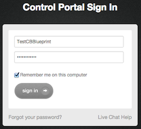
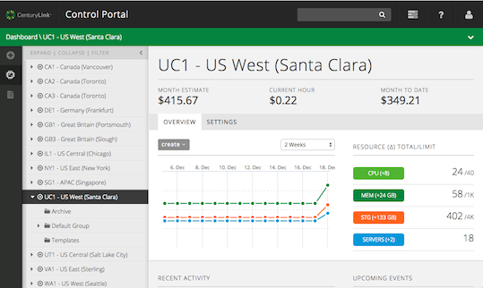
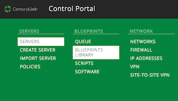
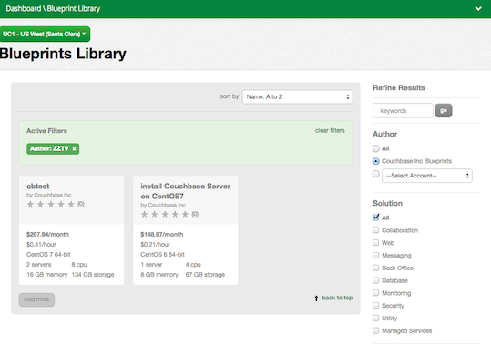
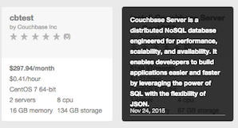
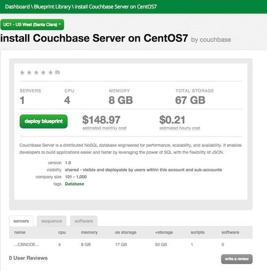
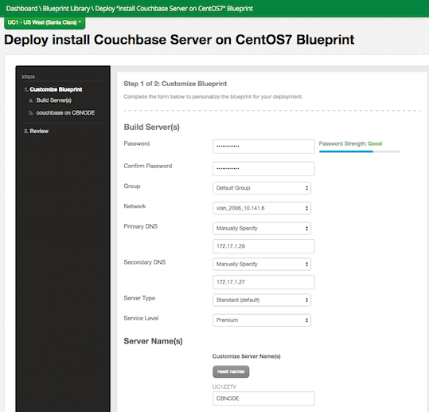
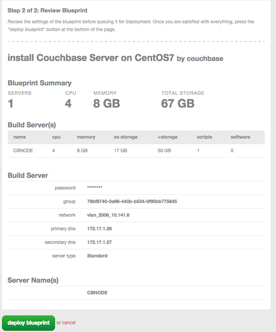
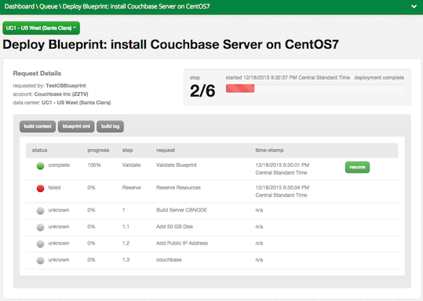

### Technology Profile

Couchbase Server is a distributed NoSQL database engineered for performance, scalability, and availability. It enables developers to build applications easier and faster by leveraging the power of SQL with the flexibility of JSON.
Couchbase Server is available on CenturyLink Cloud platform as a virtual machine (VM) image. The VM image contains Couchbase Server version 4.0.0.

### Description

<More detail on the features if required. This should be differentiating features, versioning, dependencies> 

For more information, please visit http://www.couchbase.com.

### Audience
CenturyLink Cloud Users

### Impact
After reading this article, the user should <describe what is different as a result of reading this article>

### Prerequisite
- Access to the CenturyLink Cloud platform as an authorized user.
- <More bullets as required.  Note that these are bullets>

### Postrequisite
After you successfully install a Blueprint, you will receive a notification email. If you want to access your application from a computer that is outside of the CenturyLink Cloud network, you need to perform the following steps:

< This may be none, but typically the following is required if the user is building a server that requires web login.  Is SSH is required, change ports below>

  1. [Add a Public IP](https://www.ctl.io/knowledge-base/network/how-to-add-public-ip-to-virtual-machine/) to your server through the CentiryLink Control Portal.
  2. Click on the Servers Public IP through Control Portal and configure the ports. The default port for Couchbase Server is 8091. For the additional available network ports, refer to the Couchbase Server [documentation](http://developer.couchbase.com/documentation/server/4.1/install/install-ports.html). 

### Deploying the Couchbase Server Blueprint

#### Steps to Deploy Blueprint
1. **Locate the Couchbase Server Blueprint**

   1. Log into [CenturyLink Control Portal](https://control.ctl.io) and enter your login and password.   
    
   2. Click on **sign in**. The dashboard containing CenturyLink servers will open, with the highlighted site to which you have access. 
   
   3. Select the green Dashboard area on the top and then select **Blueprints Library**.
   
   4. In the panel "Blueprints Library", if needed use the keyword search on the right to select among multiple blueprints. In our case, choose from the available displayed blueprint thumbnails.
  
2. **Choose the Blueprint**. 
  Click on **Install Couchbase Server on CentOS7**.

3. **Deploy the Blueprint.**
   In the panel "Install Couchbase Server on CentOS7", click **deploy blueprint**. 

4. **Customize the Blueprint**. Use the panel "Deploy install Couchbase Server on CentOS7 Blueprint" customize your blueprint.

    1. **Build Server(s)** by entering or choosing the following:
		* Password (for this example we use **Couchbase123**).
        * Confirm the same password.
        * Group: **default**.
        * Network: **vlan_2006_10.141.6**.
        * Primary DNS: **Manually Specify**; *172.17.1.26*.
        * Secondary DNS: **Manually Specify**; *172.17.1.27*.
        * Server Type: **Standard (default)**.
        * Service Level: **Premium**.

    2. **Server Name(s)**. Enter a name, such as **CBNODE**.
    3. **Specify Credentials**. To run the task under the default administrative account, leave **NO** for credentials. 
   
Click on **next step**.
5. **Review the Blueprint**. Verify that you have the right information: 
 
        * Group: *group ID*
        * Network: **vlan_2006_10.141.6**.
        * Primary DNS: **Manually Specify**; *172.17.1.26*.
        * Secondary DNS: **Manually Specify**; *172.17.1.27*.
        * Server Type: **Standard (default)**.
        * Service Level: **Premium**.
    1. Once you verify your information, click on the **deploy blueprint** button.   
 
6. **Deploy the Blueprint**. In the panel "Deploy Blueprint: install Couchbase Server on CentOS7" you will see the deployment details.  
  

7. **Monitor the Activity Queue**  
  
    1. Monitor the Deployment Queue to view the progress of the Blueprint deployment.
    2. Access the queue at any time by clicking the Queue link under the Blueprints menu on the main navigation drop-down.
    3. Once the Blueprint completes successfully, you will receive an email confirming that the Blueprint build is complete. Do not use the application until you have received this email notification.

### Access your <application name> server
After your Blueprint deploys successfully, follow these instructions to access your server:
  1. <task element one>
  2. <task element two>

### Pricing
The costs associated with this Blueprint deployment are for the CenturyLink Cloud infrastructure only.  There are no <Application Vendor Name><Modify this section as needed to address pricing> license costs or additional fees bundled in.

### About <Partner Name>
CenturyLink Cloud works with [Couchbase](http://www.couchbase.com/) to provide <description of partners offerings>

### Frequently Asked Questions

#### Who should I contact for support?
* For issues related to deploying the Couchbase Server Blueprint on CenturyLink Cloud, Licensing or Accessing the deployed software, please visit the [Couchbase  Support website](http://support.couchbase.com/home).
* For issues related to cloud infrastructure (VM's, network, and so on) or if you experience a problem deploying the Blueprint or Script Package, open a CenturyLink Cloud Support ticket by emailing [noc@ctl.io](mailto:noc@ctl.io) or [through the CenturyLink Cloud Support website](https://t3n.zendesk.com/tickets/new).
